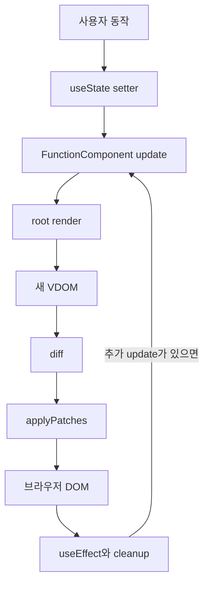

# MiniReactRuntime

Virtual DOM engine 위에 함수형 component, 상태, Hooks 실행 모델을 직접 구현한 팀 프로젝트입니다. 화면 상태가 바뀌었을 때 render 함수가 다시 실행되고 필요한 DOM만 갱신되는 과정을 작은 runtime으로 확인할 수 있습니다.


## 시작한 이유

Virtual DOM diff만 구현해서는 React의 상태가 렌더링과 어떻게 이어지는지 알기 어려웠습니다. 크래프톤 정글 수요코딩회에서 이전 주제보다 범위를 넓혀 state와 Hook slot, effect lifecycle을 직접 연결했습니다.

## 핵심 기능

| 기능 | 동작 |
| --- | --- |
| `FunctionComponent` | root render 함수와 Hook slot 소유 |
| `useState` | 값 변경 후 root update 실행 |
| `useMemo` | dependency가 달라질 때만 다시 계산 |
| `useRef` | render 사이에 같은 mutable 객체 유지 |
| `useEffect` | DOM 반영 뒤 effect 실행과 cleanup 처리 |
| keyed diff | key를 기준으로 기존 DOM node 이동 |
| history | VDOM snapshot을 이용한 이전 상태 이동 |

## 아키텍처와 코드 구조



| 경로 | 역할 |
| --- | --- |
| `src/rootRuntime.js` | component lifecycle과 Hooks 관리 |
| `src/lib/diff.js` | 일반 자식과 keyed 자식의 변경 계산 |
| `src/lib/applyPatches.js` | ADD, REMOVE, MOVE, TEXT, PROPS 반영 |
| `src/history.js` | snapshot 저장과 앞뒤 이동 |
| `runtime-demo.html` | 상태와 Hooks를 사용하는 커뮤니티 데모 |
| `history-demo.html` | diff와 history 동작 확인 |

## 문제 해결 과정

### Hook 호출 위치를 안정적으로 유지

render 때마다 함수가 다시 실행되므로 state를 지역 변수에만 두면 값이 사라집니다. component가 `hooks` 배열을 소유하고, 매 render 시작 시 `hookIndex`를 0으로 되돌려 같은 호출 순서를 같은 slot에 연결했습니다.

조건문 때문에 Hook 개수가 달라지거나 같은 slot에서 다른 Hook을 호출하면 이전 상태를 잘못 읽습니다. 첫 render의 Hook 개수와 각 slot의 종류를 저장해 순서가 바뀌는 즉시 오류를 내도록 했습니다.

### render 중 발생한 update를 다음 순서로 넘김

effect나 render 도중 다시 update를 실행하면 현재 갱신과 다음 갱신이 겹칠 수 있습니다. `isRendering`, `isFlushingEffects` 상태에서는 바로 중첩 실행하지 않고 `needsRerender`만 표시했습니다.

현재 DOM 반영과 effect 실행이 끝난 뒤 표시된 update를 다시 처리해 한 번의 갱신 흐름이 끝나기 전에 다른 흐름이 끼어들지 않게 했습니다.

### keyed 목록에서 DOM identity 보존

index만 비교하면 항목 순서가 바뀔 때 기존 node를 새 node로 잘못 대응할 수 있습니다. 형제의 key를 map으로 만들고 REMOVE, ADD, MOVE를 계산해 기존 DOM node 자체를 옮겼습니다.

중복 key는 어느 node를 가리키는지 결정할 수 없으므로 오류로 처리하고, keyed와 unkeyed 항목이 섞인 목록은 기존 index 비교로 남겼습니다.

### effect cleanup 시점 정리

effect는 DOM 반영 전에 실행하지 않고 patch가 끝난 뒤 처리했습니다. dependency가 바뀌면 이전 cleanup을 먼저 실행하고, unmount에서는 남아 있는 모든 effect cleanup과 DOM 제거를 함께 수행합니다.

## 기여

Virtual DOM, diff, patch, history와 runtime은 팀이 역할을 나누어 만든 결과입니다. 저는 완성된 모듈을 사용자가 확인할 수 있는 데모 흐름으로 연결했습니다.

- history와 runtime demo 진입 화면 정리
- 커뮤니티 예제 화면과 상호작용 구성
- 데모 UI의 상태 표시와 사용 흐름 개선
- 예제 페이지와 발표용 시나리오 제작

## 실행 방법

Node.js 22 이상에서 실행합니다.

```bash
npm ci
npm run dev
```

Vite 주소에서 다음 화면을 확인할 수 있습니다.

| 경로 | 내용 |
| --- | --- |
| `/runtime-demo.html` | 상태와 Hooks를 사용하는 커뮤니티 데모 |
| `/history-demo.html` | VDOM diff와 history 데모 |

## 테스트

```bash
npm test -- --run
npm run build
```

Vitest 63개가 component lifecycle, Hook slot, keyed diff, patch, history를 검사합니다.

## 남은 과제

- 자식 component도 독립적인 state와 Hook slot을 갖도록 instance tree 확장
- 여러 state 변경을 한 번에 반영하는 batching 추가
- error boundary와 asynchronous scheduling 실험

## 관련 프로젝트

- [VirtualDOMPlayground](https://github.com/NearthYou/VirtualDOMPlayground): Virtual DOM 변환, diff, patch, undo와 redo를 구현한 별도 팀 프로젝트
