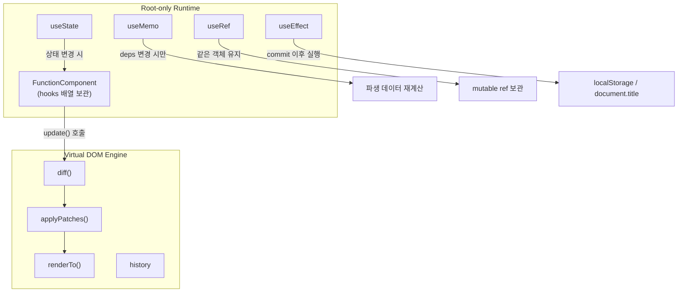
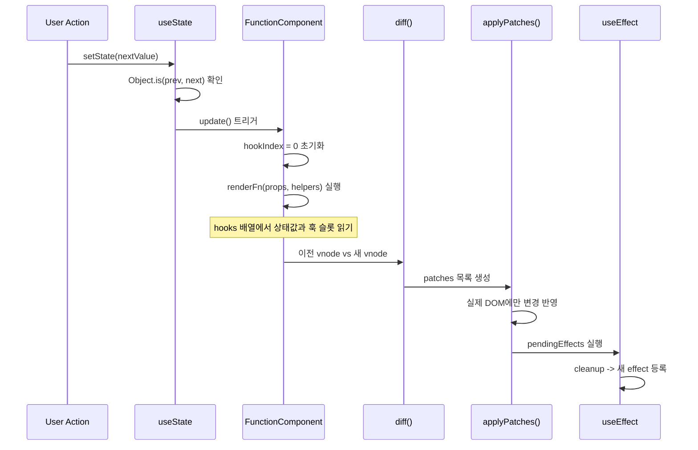

# mini-react

> A team-built Virtual DOM and root-only component runtime that demonstrates DOM/VDOM conversion, keyed diff/patch, history, and basic Hooks without React internals such as Fiber or scheduling.

Virtual DOM 엔진 위에 root-only Component, State, Hooks runtime을 올려 React의 핵심 동작을 직접 추적하는 팀 학습 프로젝트입니다.

---

## 공동 구현과 기여 범위

이 저장소의 VDOM, diff, patch, history, runtime은 팀 설계와 페어 프로그래밍으로 완성했습니다. 아래 표는 공동 작업을 개인 단독 구현으로 바꾸지 않기 위해 Git에 직접 남은 commit과 이시원의 역할을 분리한 것입니다. 페어 프로그래밍 참여는 협업 맥락이며, 다른 팀원이 author인 core commit을 이시원의 단독 코드로 주장하지 않습니다.

| 영역 | repository-visible 근거 |
| --- | --- |
| DOM ↔ VDOM conversion | team commit `6034aa9` |
| diff / patch | team commits `19de11b`, `0155df9` |
| history demo와 snapshot UI | team commits `b35ddac`, `35393af` |
| root-only runtime과 Hooks | team commits `65739fe`, `966db01`, `c865689` |
| 이시원 | 페어 프로그래밍·공동 설계 참여, demo integration/UI polish `d8d58da`, example pages `080a7d7`, README presentation `7137ba7`–`dd1b876` |

Git commit은 author가 직접 남긴 변경 범위를 보여주지만, pair session의 대화와 공동 판단 전체를 기록하지는 않습니다. 따라서 core는 팀 결과로, 이시원의 개인 증거는 author commit이 확인되는 demo·UI·example·문서 범위로 제시합니다.

## 무엇을 만들었나

이번 과제의 목표는 React의 핵심 개념인 **Component, State, Hooks를 직접 구현**하고, 그 위에서 실제로 동작하는 웹 페이지를 만드는 것이었습니다.

기존에 만들었던 Virtual DOM → Diff → Patch 파이프라인 위에, 함수형 컴포넌트를 실행하고 상태와 Hook 정보를 관리하는 **내부 실행 로직**을 추가하는 방식으로 구현했습니다.

현재 runtime은 루트 컴포넌트 기준으로 `useState`, `useMemo`, `useRef`, `useEffect`를 지원하며, 이 Hook들이 Virtual DOM 엔진 위에서 어떻게 동작하는지 직접 따라가 볼 수 있습니다.

---

## 핵심 아이디어

함수형 컴포넌트를 그냥 호출하는 것이 아니라, **`FunctionComponent` 클래스로 감싸서 상태와 Hook 실행 정보를 직접 관리**합니다.

이 클래스는 크게 세 가지 역할을 합니다.

- **첫 번째**: `hooks` 배열로 state, memo, ref, effect 슬롯을 저장하는 것
- **두 번째**: `mount()`로 최초 렌더링하는 것
- **세 번째**: `update()`로 상태 변경 이후 다시 렌더링하는 것

```text
렌더 함수는 매번 다시 실행되지만,
상태값과 훅 슬롯은 함수 바깥의 hooks 배열에 저장되기 때문에 유지됩니다.
```

| 역할 | 방법 |
|------|------|
| Hook 슬롯 저장 | `hooks[]` 배열에 state / memo / ref / effect 정보 보관 |
| 최초 렌더 | `mount(container, initialProps)` |
| 상태 변경 후 재렌더 | `update(nextProps)` -> diff -> patch |
| 정리 | `unmount()` -> 모든 effect cleanup 실행 |

## 아키텍처

프로젝트는 두 레이어로 구성됩니다.

```text
┌─────────────────────────────────────────────┐
│              Root-only Runtime              │
│   FunctionComponent · mountRoot            │
│   useState · useMemo · useRef · useEffect  │
├─────────────────────────────────────────────┤
│             Virtual DOM Engine              │
│   domToVdom · vdomToDom · diff             │
│   applyPatches · renderTo · history        │
└─────────────────────────────────────────────┘
```



---

## 구현 근거

| 동작 | 코드 | 테스트 |
| --- | --- | --- |
| DOM → VDOM | `src/lib/domToVdom.js` | `tests/lib/domToVdom.test.js` |
| VDOM → DOM | `src/lib/vdomToDom.js` | `tests/lib/vdomToDom.test.js` |
| diff와 keyed move | `src/lib/diff.js` | `tests/lib/diff.test.js` |
| patch 적용 | `src/lib/applyPatches.js` | `tests/lib/applyPatches.test.js` |
| undo/redo history | `src/history.js` | `tests/history.test.js` |
| root runtime과 Hooks | `src/rootRuntime.js` | `tests/rootRuntime.test.js` |
| demo entrypoint contract | `index.html`, `history-demo.html`, `runtime-demo.html` | `tests/entrypoints.test.js`, `runtimeDemoMarkup.test.js` |

`diff()`는 새 tree를 만들지 않고 patch 목록을 계산하며, `applyPatches()`가 실제 DOM mutation을 담당합니다. history는 VDOM snapshot을 cursor로 이동해 undo/redo 대상을 관리합니다. runtime은 이 engine을 교체하지 않고 root component update의 render target으로 사용합니다.

---

## 렌더 사이클

상태가 바뀌면 어떤 일이 일어나는지 한눈에 볼 수 있습니다.



---

## Runtime API

### `FunctionComponent`

루트 컴포넌트를 감싸는 클래스. 이 인스턴스가 직접 runtime 상태를 소유합니다.

```js
const Root = new FunctionComponent((props, { renderChild }) => {
  const [count, setCount] = useState(0);

  return elementNode("section", {}, [
    renderChild(Row, { label: "count", value: String(count) }),
  ]);
});
```

| 프로퍼티/메서드 | 역할 |
|----------------|------|
| `hooks` | state, memo, ref, effect 정보 저장 배열 |
| `hookIndex` | 렌더 중 현재 hook 위치 커서 |
| `pendingEffects` | commit 후 실행 대기 중인 effect 목록 |
| `mount(container, initialProps)` | 최초 렌더링 |
| `update(nextProps)` | 상태 변경 후 재렌더 |
| `unmount()` | effect cleanup 후 DOM 제거 |

### `mountRoot`

기존 사용성을 위한 얇은 wrapper입니다.

```js
const app = mountRoot(container, Root, { initialCount: 1 });
app.rerender();
app.setProps({ initialCount: 2 });
app.unmount();
```

---

## Hooks

### `useState`

```js
const [count, setCount] = useState(0);
setCount(prev => prev + 1); // updater 함수도 지원
```

- 값 또는 updater 함수를 받습니다.
- `Object.is(prev, next)`가 같으면 rerender를 생략합니다.

### `useMemo`

```js
const filteredPosts = useMemo(
  () => posts.filter(p => p.category === selected),
  [posts, selected]
);
```

- `{ value, deps }`를 캐시합니다.
- deps는 `Object.is` 기반 shallow compare를 사용합니다.
- 의존성이 바뀐 경우에만 계산을 다시 수행합니다.

### `useRef`

```js
const prevStateRef = useRef(null);
prevStateRef.current = posts;
```

- `{ current }` 객체를 반환합니다.
- 같은 Hook 슬롯에서는 같은 ref 객체를 유지합니다.
- `ref.current` 변경만으로는 rerender되지 않습니다.

### `useEffect`

```js
useEffect(() => {
  localStorage.setItem("posts", JSON.stringify(posts));
  return () => { /* cleanup */ };
}, [posts]);
```

- commit 이후 실행됩니다.
- deps 변경 시 이전 cleanup을 먼저 실행합니다.
- `unmount()` 때 모든 cleanup을 정리합니다.

---

## 데모

### `/runtime-demo.html` - 네이버 카페형 커뮤니티 서비스

mini-react로 구현한 메인 데모입니다.

| 기능 | 설명 |
|------|------|
| 로그인 / 로그아웃 | `isLoggedIn` 상태 변경 -> 레이아웃 전환 |
| 글쓰기 / 수정 | `posts` 상태 변경 -> diff -> patch |
| 좋아요 | `liked`, `likes` 변경 -> 목록·상세·통계 동시 갱신 |
| 검색 / 카테고리 / 정렬 | `useMemo`로 파생 데이터 캐싱 |
| 상태 추적 보조 | `useRef`로 이전 상태 참조 같은 mutable 값 유지 |
| 새로고침 유지 | `useEffect`로 `localStorage` 자동 저장 |

**상태 흐름 예시 - 좋아요 버튼 클릭:**

```text
클릭 -> posts[i].liked, likes 변경
     -> update() 실행
     -> 새 vnode 생성
     -> diff -> patch
     -> 목록 / 상세 패널 / 통계 동시 갱신  <- Lifting State Up
```

> 상태를 한 곳에 모으는 **Lifting State Up** 방식의 장점이 여기서 드러납니다.

### `/history-demo.html` - Diff / History Demo (Week 4)

편집 가능한 DOM 비교, patch 적용, history 이동을 확인할 수 있는 기존 데모입니다.

---

## 실행

```bash
npm ci
npm run dev
```

Vite 주소를 연 뒤 아래 페이지를 확인하세요.

| 경로 | 내용 |
|------|------|
| `/` | 과제 허브 (Week 4 · Week 5 링크) |
| `/runtime-demo.html` | 커뮤니티 서비스 데모 |
| `/history-demo.html` | Diff / History 데모 |

---

## 테스트

```bash
npm test -- --run
npm run build
```

2026-07-18 기준 Vitest 10 files, 63 tests가 통과했고 Vite production build가 성공했습니다. diff, patch, history, runtime, demo entrypoint를 함께 검증합니다.

---

## 의도적인 제약과 한계

- Hook과 State는 **루트 컴포넌트에서만** 사용할 수 있습니다.
- 자식 컴포넌트는 `(props) => vnode` 형태의 stateless plain function입니다.
- 상태는 root가 소유하고 자식은 props를 받아 화면 조각만 렌더링합니다.

| 항목 | mini-react | React |
|------|-----------|-------|
| Hook 사용 범위 | 루트 컴포넌트만 | 모든 컴포넌트 |
| 자식 컴포넌트 상태 | ❌ (props only) | ✅ |
| `useRef` 지원 범위 | 루트 컴포넌트만 | 모든 컴포넌트 |
| Fiber / Scheduler | ❌ | ✅ |
| Context / Reducer | ❌ | ✅ |
| Batching | ❌ | ✅ |

또한 concurrent rendering, hydration, error boundary, synthetic event system을 구현하지 않았습니다. 학습용 구현이므로 **작고 설명 가능한 구조**와 patch 흐름의 관찰 가능성을 우선했습니다.
